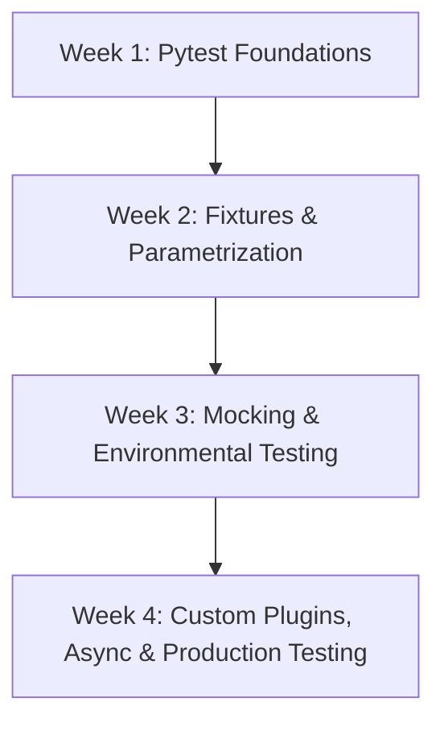

# Pytest Mastery Curriculum: From Beginner to Expert in 1 Month

A comprehensive, hands-on, daily training program designed to transition you from writing simple tests to developing custom pytest plugins, advanced mock engines, and production-grade test suites.

---

## User Review Required

Please review the proposed syllabus and execution model. We will proceed **one module (or one day) at a time** depending on your feedback. Each day will consist of a **Concept Markdown** (`dayX_concepts.md`), a **Practical Assignment** (`dayX_assignment.py`), and a **Self-Verification Test Suite** (`dayX_test.py` - written in pytest!).

> [!IMPORTANT]
> - All lessons and files will be placed inside your local workspace directory under [pytest_expert](file:///g:/Backup%20Fdrive/Python/pytest_expert/).
> - We will run the tests using `pytest` itself to verify your assignments. This ensures you are constantly using the tool you are learning.
> - You will need Python installed with `pytest` in your virtual environment. If not configured, Day 1 will handle the setup.

---

## Open Questions

> [!IMPORTANT]
> 1. **Current Testing Experience:** Have you written tests before in Python (using `unittest` or basic assertions), or is this your first time writing test code?
> 2. **Pace & File Creation:** Do you want me to generate the materials **day-by-day** (recommended, so we can adjust the complexity based on your assignment submissions) or would you prefer a batch of days generated at once?
> 3. **Python Environment:** Are you currently using a specific virtual environment for this workspace? (e.g., the `.venv` in the workspace root). If so, we'll install `pytest` in it.

---

## Proposed Curriculum

The course is divided into 4 weekly modules, escalating in difficulty.



### Week 1: Foundations of Testing & Assertion Magic
*Focus: Shifting from unittest mindset to pytest philosophy, understanding assertion rewriting, and test runner execution.*
* **Day 1: Intro to Pytest & Development Setup**
  * Installing pytest, naming conventions (files, classes, functions), writing the first test.
* **Day 2: Assertion Magic & Raising Exceptions**
  * Understanding how pytest inspects assertions, comparing complex structures (dicts, nested lists, sets), and using `pytest.raises` for exception checking.
* **Day 3: Pytest CLI Execution & Filters**
  * Running specific files/classes/tests, substring matching (`-k`), verbose mode (`-v`), print output capturing (`-s`), and exiting early (`-x`, `--lf`).
* **Day 4: Built-in Markers (Skip, SkipIf, XFail)**
  * Handling platform-specific code, slow tests, known bugs, and expected failures.
* **Day 5: Custom Markers & Pytest Configuration**
  * Creating custom markers, registering them in `pytest.ini` / `pyproject.toml`, and running specific marker suites (`-m`).
* **Day 6: Week 1 Integration Assignment**
  * Building and testing a core validation library using customized assertions, custom markers, and exception boundaries.
* **Day 7: Weekly Review & Retrospective**

### Week 2: Dependency Injection & Parametrization
*Focus: Master pytest's strongest feature: Fixtures. Learn scope management, sharing fixtures, and running data-driven test matrices.*
* **Day 8: Intro to Fixtures & Setup/Teardown**
  * Dependency injection, writing basic fixtures, and cleanups using `yield`.
* **Day 9: Fixture Scopes & Autouse**
  * Controlling fixture lifetimes: `function`, `class`, `module`, `session` scopes. Auto-running background configurations using `autouse=True`.
* **Day 10: Sharing Fixtures via `conftest.py`**
  * Structuring multi-folder tests, fixture discovery hierarchy, and organization patterns.
* **Day 11: Dynamic Fixtures & the `request` Object**
  * Accessing test metadata from inside a fixture, using `request.param` for fixture parametrization.
* **Day 12: Test Parametrization (`@pytest.mark.parametrize`)**
  * Eliminating duplicate test functions, passing tables of inputs/outputs, stack parametrization, and naming test ids dynamically.
* **Day 13: Week 2 Integration Assignment**
  * Designing a robust testing system for an inventory/shopping cart module with transactional state, databases (simulated), and multiple test profiles.
* **Day 14: Weekly Review & Retrospective**

### Week 3: Mocking, Monkeypatching, and System Testing
*Focus: Isolating tests from external services, patching functions/classes, and interacting safely with OS/networking.*
* **Day 15: Mocking Basics with `unittest.mock`**
  * Why mock? Mocking function return values, checking call histories, and using `MagicMock`.
* **Day 16: Monkeypatching (`monkeypatch` Fixture)**
  * Changing environment variables, patching modules, dynamic configurations, and restoring state automatically.
* **Day 17: Standard System Fixtures (`tmp_path`, `capsys`, `caplog`)**
  * Writing file system tests securely without clean-up overhead, capturing console logs, and asserting stdout/stderr.
* **Day 18: Testing External HTTP Clients**
  * Using `requests-mock` or `responses` to stub external APIs, testing error codes, and checking request payloads.
* **Day 19: Database State & Transactional Fixtures**
  * Setting up databases for testing, seeding test tables, and rolling back changes between tests.
* **Day 20: Week 3 Integration Assignment**
  * Testing an automated data synchronization engine that pulls API feeds, parses files, logs warnings, and saves to a database.
* **Day 21: Weekly Review & Retrospective**

### Week 4: Custom Plugins, Async, and Scalability
*Focus: Writing enterprise-grade test suites, custom plugins, profiling speed, and parallel test execution.*
* **Day 22: Testing Async Code (`pytest-asyncio`)**
  * Testing async functions, using async fixtures, and managing event loop scopes.
* **Day 23: Code Coverage & Test Analytics (`pytest-cov`)**
  * Measuring coverage, understanding code branches, generating HTML reports, and enforcing strict coverage gates in CI/CD.
* **Day 24: Custom Command-Line Options**
  * Writing custom CLI flags in `conftest.py` using `pytest_addoption`, and adapting test behaviors based on user input.
* **Day 25: Pytest Hooks & Plugin Development**
  * Deep dive into pytest hooks: `pytest_runtest_setup`, custom HTML report generation, and writing your first custom plugin.
* **Day 26: Parallelization, Speed & Profiling (`pytest-xdist`)**
  * Scaling tests to run in parallel on multiple cores, utilizing `--durations` to identify slow tests, and optimizing test execution time.
* **Day 27: Capstone Project: Enterprise test suite**
  * Building a fully functional test framework for an async web application, incorporating external mock services, dynamic flags, and custom HTML logs.
* **Day 28-30: Final Wrap-up, Style guides, and CI/CD Integrations**
  * Setting up Pytest in GitHub Actions/GitLab CI, configuring pre-commit hooks, and professional styling conventions.

---

## Verification Plan

### Automated Verification
* Every daily assignment `dayX_assignment.py` will have a companion test script `dayX_test.py`.
* To verify your code, you will run:
  ```bash
  pytest dayX_test.py
  ```
* We will write the test runner such that passing all checks completes the day's goals.

### Manual Verification
* We will review the tests you write, check execution logs, and analyze the coverage reports.
* We can use screenshots and logs to verify setup commands and custom plugins.
